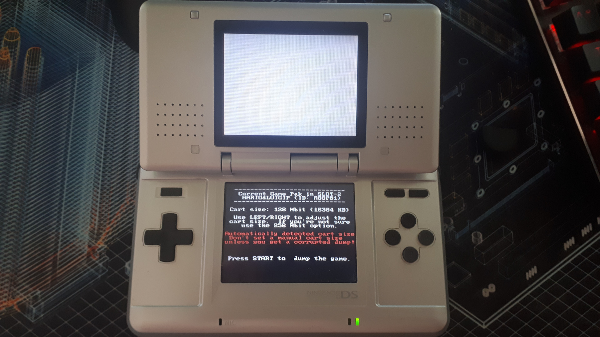
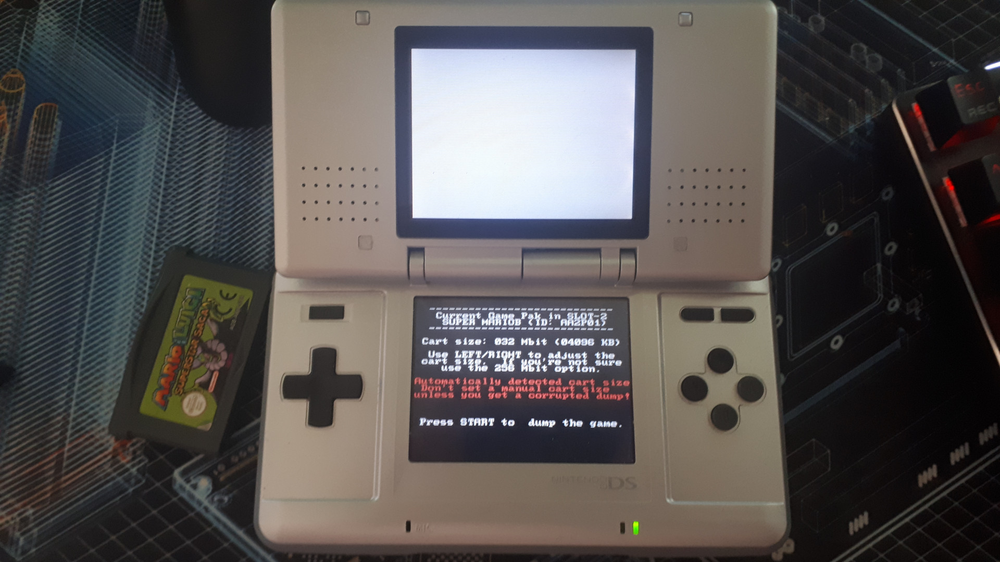

# GBA-Dump
GBA-Dump is a simple homebrew application that can dump Game Boy Advance Game Paks from within DS-mode, bypassing the requirement of expensive rom-dumping hardware as long as you have a SLOT-1 (DS) flash card and either a DS Phat or DS Lite console.

## Features
* Automatically detects the size of the Game Pak in SLOT-2.
* Supports all Game Paks from 1 Mbit (128K) to 256 Mbit (32M) in size.
* Game Paks can be hot-swapped while GBA-Dump is running. (Just don't do it while you're dumping one)
* Automatically detected Game Pak size can be overwritten if needed. (Useful for reproductions with larger ROM chips)

## How to use GBA-Dump
Grab the latest GBA-Dump.nds from the release tab, put it on your flash card, put that one into your DS and boot into the flash cards firmware. From there run the GBA-Dump.nds file. If everything worked so far you should be greeted by the "main menu" of GBA-Dump. Insert a GBA Game Pak (if you haven't already) and make sure it's detected properly (GBA-Dump will display the games internal name and ID6, it'll also show you the size of the ROM chip), if everything appears to be fine press START to dump the Game Pak. This should only take a brief moment, at worst expect it to take 1 - 2 minutes for a 256 Mbit game. Once you've dumped everything power off the DS and plug the DS into your PC. Dumped ROMs will be show up in the root directory of the drive following this naming scheme: "<Internal Game Name> (AGB-P-<ID6>).gba" (Example: A PAL copy of "Super Mario Advance 2: Super Mario World" would be called "SUPER MARIOB (AGB-P-AA2P).gba"). Copy these files to somewhere and you're done. 
  
## Troubleshooting
**GBA-Dump isn't detecting the inserted Game Pak:** Try cleaning the contacts of the Game Pak and SLOT-2. Use a Q-Tip and some rubbing alcohol and make sure to dry them off before trying again. If that didn't work and the game isn't showing up as a GBA game when powering on the DS it's probably broken. If you're encountering this issue on a DSi or 3DS I recommend you read the first sentence of this file again.
  
**GBA-Dump thinks the Game Pak has a capacity of XXX Mbis but really it's ZZZ Mbit:** You're most likely trying to dump a reproduction or the Game Pak is damaged. Try to manually set the capacity by using DPAD left and DPAD right. If you're not sure go with 256 Mbit. 
  
**I dumped a Game Pak but there's no ROM on the SD card:** Try inserting and dumping the Game Pak again. If that didn't help check that the SD card filesystem isn't corrupted, that there's less than 65.536 files on the root of the SD card (FAT32 limit) and that there's still enough space left on the SD card. If all of that didn't help contact me.
  
## GBA-Dump in action:

